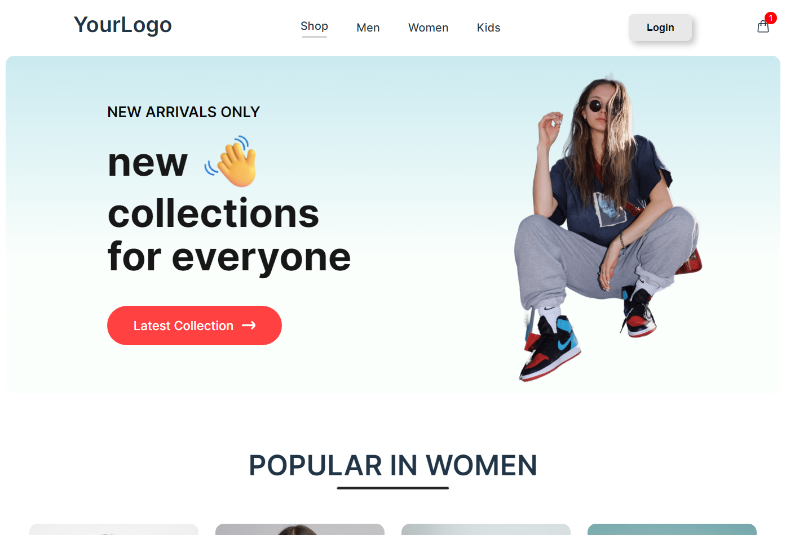

## eCommerce Single Page Application
This is a fully responsive eCommerce single page application with cart functionality and beautiful visuals. The project is built using Vite, React, React DOM, and React Router.

## Features
-**Responsive Design**: Optimized for all devices including desktops, tablets, and mobile phones.
-**Cart Functionality**: Add, remove, and manage items in the cart.
-**Beautiful Visuals**: Sleek and modern design.
-**Single Page Application**: Seamless navigation without page reloads.

## Getting Started
These instructions will help you set up the project on your local machine for development and testing purposes.

# Prerequisites
Ensure you have Node.js and npm installed. You can download and install them from Node.js.

# Installation
1. Clone the repository:

```sh
    git clone https://github.com/your-username/ecommerce-spa.git
    cd ecommerce-spa
```

2. Install the dependencies:

```sh
    npm install
```

# Running the App
To run the app in development mode:

```sh
    npm run dev
```

Open http://localhost:5173 to view it in your browser. The app will reload if you make edits.

# Building for Production
To build the app for production:

```sh
    npm run build
```

This will create an optimized build of your app in the dist directory.

# Previewing the Production Build
To preview the production build locally:

```sh
    npm run preview
```
This will start a local server to serve the built files.

# Linting
To run ESLint and check for code quality issues:

```sh
npm run lint
```

This will lint your code based on the rules defined in your ESLint configuration.

## Project Structure
/src
/components: Reusable React components.
/pages: Different pages of the app.
/assets: Images and other static assets.
App.js: Main app component.
main.js: Entry point of the app.

## Contributing
Contributions are welcome! Please open an issue or submit a pull request for any changes or enhancements.

## License
This project is licensed under the MIT License - see the LICENSE file for details.

## Contact
For any inquiries, please contact cotne.sxvitaridze@gmail.com